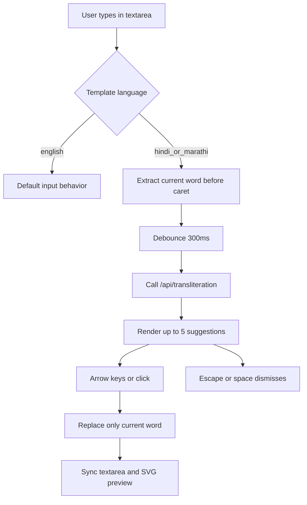

# Implement Regional Language Transliteration Typing

## Scope
Add a typed `language` field to templates and wire a transliteration suggestion flow into the inline text editor overlay used in the SVG editor. English stays unchanged; Hindi/Marathi get phonetic suggestions while typing.

## Key Files
- [/home/hemendra/Banana/Software Projects/Greeting Card E-commerce/Codebase/frontend/lib/templates.ts](/home/hemendra/Banana/Software Projects/Greeting Card E-commerce/Codebase/frontend/lib/templates.ts)
- [/home/hemendra/Banana/Software Projects/Greeting Card E-commerce/Codebase/frontend/app/editor/[id]/page.tsx](/home/hemendra/Banana/Software Projects/Greeting Card E-commerce/Codebase/frontend/app/editor/[id]/page.tsx)
- [/home/hemendra/Banana/Software Projects/Greeting Card E-commerce/Codebase/frontend/app/api/transliteration/route.ts](/home/hemendra/Banana/Software Projects/Greeting Card E-commerce/Codebase/frontend/app/api/transliteration/route.ts)
- [/home/hemendra/Banana/Software Projects/Greeting Card E-commerce/Codebase/frontend/components/template-card.tsx](/home/hemendra/Banana/Software Projects/Greeting Card E-commerce/Codebase/frontend/components/template-card.tsx)
- [/home/hemendra/Banana/Software Projects/Greeting Card E-commerce/Codebase/frontend/contexts/cart-context.tsx](/home/hemendra/Banana/Software Projects/Greeting Card E-commerce/Codebase/frontend/contexts/cart-context.tsx)
- [/home/hemendra/Banana/Software Projects/Greeting Card E-commerce/Codebase/frontend/contexts/wishlist-context.tsx](/home/hemendra/Banana/Software Projects/Greeting Card E-commerce/Codebase/frontend/contexts/wishlist-context.tsx)

## Design
- Define `TemplateLanguage` in `templates.ts` (e.g. `"english" | "hindi" | "marathi"`) and add `language` to every template entry.
- In editor page, read `template.language` and enable transliteration only when language is Hindi/Marathi.
- Use a server API route as a proxy to Google Input Tools (safer for CORS/retries and keeps external API details centralized).
- Transliteration is word-scoped:
  - Compute current word as text after last whitespace before caret.
  - Debounce lookup by 300ms.
  - Show max 5 suggestions in an absolutely-positioned dropdown below `#txt-editor-overlay`.
  - Replace only current word on selection.
  - Keyboard: `ArrowUp/ArrowDown` move active suggestion, `Enter` apply, `Escape` close.
  - On `Space`, commit word as-is and reset suggestion state.
- Keep existing editor commit behavior (`Escape`, `Enter`, `Ctrl/Cmd+Enter`, blur commit) intact when suggestions are not active.

## Interaction Flow

## Implementation Notes
- Keep transliteration state local to the inline editing session in `openEditor` lifecycle; clear listeners/state on commit/close.
- Guard key conflicts so suggestion navigation does not break existing editor submit shortcuts.
- Reuse existing visual classes for lightweight chip-like buttons; avoid introducing heavy new dependencies.
- Update payload types where template objects are stored (cart/wishlist) so `language` stays type-safe end-to-end.

## Validation
- Verify typing behavior for:
  - English template: no suggestions, unchanged behavior.
  - Hindi/Marathi template: suggestions appear after debounce and apply correctly.
- Verify edge cases:
  - Empty current word, punctuation, cursor in middle of text, multiline textarea.
  - Space commits current word and resets dropdown.
  - Enter applies suggestion when dropdown active; otherwise preserve existing commit semantics.
- Run lints for edited files and resolve any newly introduced issues.